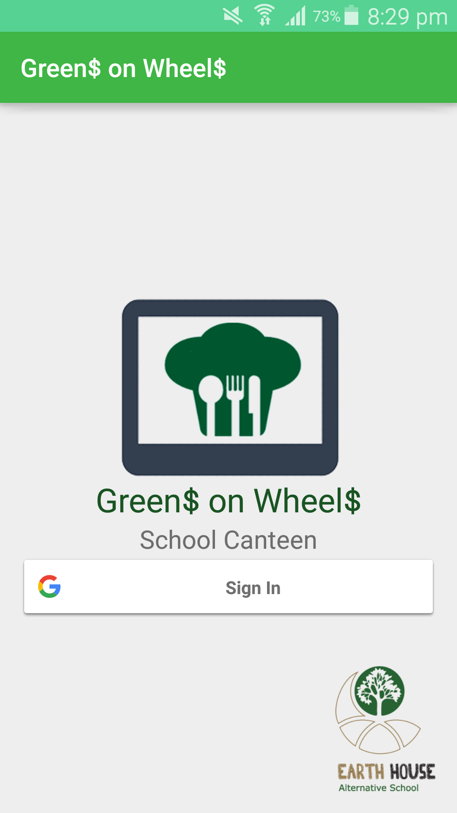
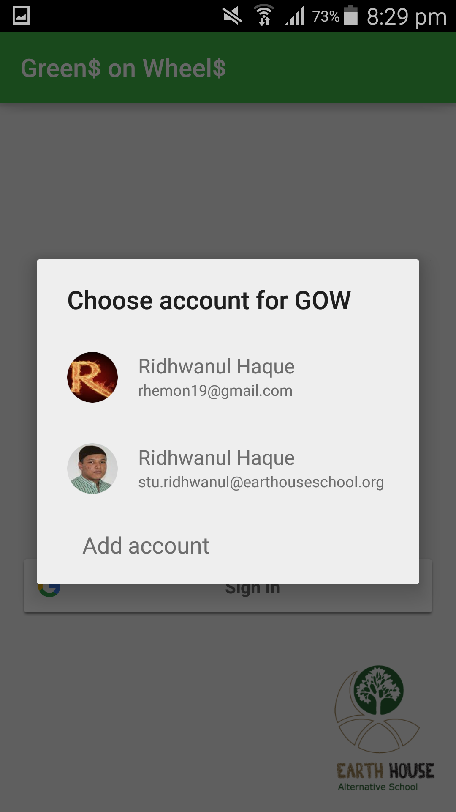
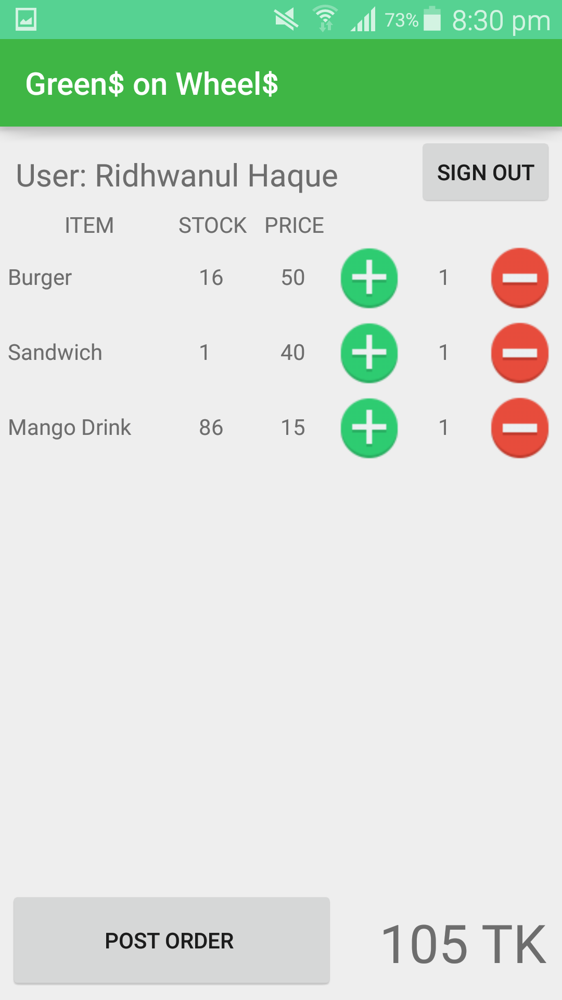

# GreensOnWheels
----------------

Simple app for school canteen. Uses google spreadsheet, where students could put
menu item for the catneen, and that would be viewed in the app. Students' orders
are then also stored in a google spreadsheet, for canteen staff to view.

How the app looks:
 
 
 
 
 
